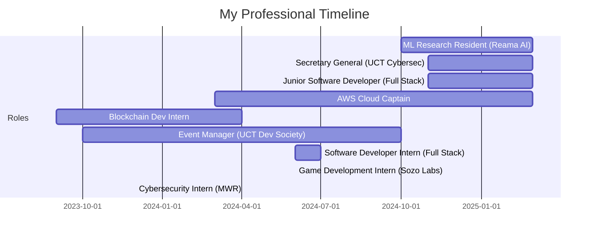

# 
✨ PRAISE JARAVANI ✨

  

  
  
   
  
  
  
  

 

  

## 
🚀 About Me 🚀

🎓 Computer Science and Computer Engineering student at **University of Cape Town** with distinction, passionate about the intersection of software development and emerging technologies.

🏆 **Hackathon Champion**: Secured FIRST PRIZE at the Algorand/Finhub Blockchain Hackathon, winning 50,000 Rand cash & 75,000 Rand bursary with a blockchain-powered voting solution.

🌱 Currently exploring AI/ML, Cybersecurity, and VR realms while crafting impeccable code with various technologies.

💡 AWS Cloud Captain with experience in building sustainable energy solutions through machine learning.

🔍 Strong communicator, analytical thinker, and collaborative innovator eager to tackle complex challenges.

  

## 
💼 Experience Journey 💼

  

### 

- **Machine Learning Research Resident** at Reama AI (Oct 2024 - Present)
  > 🌱 Driving innovation in sustainable energy through AI  
  > 🤖 Developing machine learning models for energy optimization  
  > 📊 Creating data-driven solutions for asset management  
  > 🔧 Building and training AI tools to improve operational efficiency  

- **Secretary General** at UCT Evolve Cybersec Society (Nov 2024 - Present)
- **Junior Software Developer** at Full Stack (Nov 2024 - Present)
- **AWS Cloud Captain** at AWS Cloud Club IGDTUW (Mar 2024 - Present)

## 
🔥 Tech Stack & Skills 🔥

<table align="center">
  <tr>
    <td valign="top" width="33%">
      <h3 align="center">Frontend</h3>
      

        
        
        
        
        
        
      

    </td>
    <td valign="top" width="33%">
      <h3 align="center">Backend</h3>
      

        
        
        
        
        
      

    </td>
    <td valign="top" width="33%">
      <h3 align="center">Specialized</h3>
      

        
        
        
        
        
        
      

    </td>
  </tr>
</table>

  

## 
🏗️ Flagship Projects 🏗️

  
  

### 

  

Developed during Sozolabs Game Jam. An endless runner space game where humanity's last hope is to navigate through a perilous asteroid field to secure a future for mankind.

- **Tech Stack**: Unity, Game Development
- **Features**: Health System, Boss Battles, Worm Holes, Power-ups
- **Link**: [GitHub Repository](https://github.com/praise-jaravani/Game-Jam---Space-Racer)

### 

  

A web application leveraging OpenAI's DALL-E2 API to help visualize different styles for your images. Upload images and see yourself with various styles.

- **Tech Stack**: React.js, Tailwind CSS, OpenAI API
- **Features**: Image Upload, Style Generation, AI-Powered Design
- **Link**: [GitHub Repository](https://github.com/praise-jaravani/AI-Styler)

## 
📊 GitHub Analytics 📊

  
  

  

## 
🏆 Achievements & Awards 🏆

<table align="center">
  <tr>
    <td>
      🥇 <b>Blockchain Hackathon Champion</b>
    </td>
    <td>
      First Prize at Algorand/Finhub Blockchain Hackathon
    </td>
  </tr>
  <tr>
    <td>
      🎓 <b>Outstanding Cambridge Learner</b>
    </td>
    <td>
      Best National IGCSE results in Zimbabwe for ICT
    </td>
  </tr>
  <tr>
    <td>
      🎤 <b>BLYTHE KRUGER TROPHY</b>
    </td>
    <td>
      Best Vocal Solo in Zimbabwe Under 18
    </td>
  </tr>
  <tr>
    <td>
      📰 <b>Chief Editor</b>
    </td>
    <td>
      School Newspaper, overseeing content and layout
    </td>
  </tr>
</table>

## 
⚡ Current Interests ⚡

  <table>
    <tr>
      <td>
        
      </td>
      <td>
        
      </td>
      <td>
        
      </td>
      <td>
        
      </td>
    </tr>
    <tr>
      <th>Artificial Intelligence</th>
      <th>Blockchain Technology</th>
      <th>Cybersecurity</th>
      <th>Game Development</th>
    </tr>
  </table>

---

  
    
  
  
  <h3>🚀 Let's connect and embark on thrilling software engineering adventures! 🌟</h3>

<!-- Custom CSS can be added with HTML when viewed on GitHub -->
